<p align="center">
  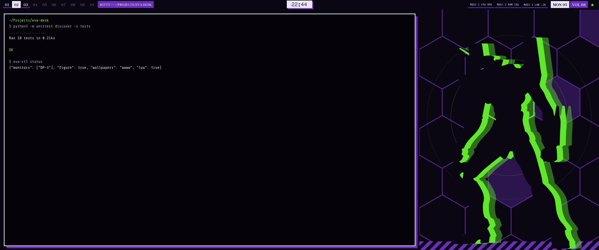
</p>

<h1 align="center">eva-desk</h1>

<p align="center">A Neon Genesis Evangelion desktop for Hyprland.</p>

<p align="center">
  <a href="#install">Install</a> ·
  <a href="#features">Features</a> ·
  <a href="#configuration">Configuration</a> ·
  <a href="#other-apps">Other apps</a> ·
  <a href="#lock-and-login">Lock and login</a> ·
  <a href="#faq">FAQ</a>
</p>

---

eva-desk is a daemon that runs next to Hyprland and draws the desk: a bar, a launcher, a screenshot tool,
wallpapers, and Unit-01 standing behind your windows. The look comes from the show's title cards and
computer screens: heavy mincho type, monospace readouts, purple and acid green on black, hazard stripes when
something is wrong. Nothing animates for long. Every effect is a single cut or pulse, then the picture holds still.

It needs Hyprland's Lua config (`hyprland.lua`). It does not work with the classic `hyprland.conf`.

## Features

<p align="center">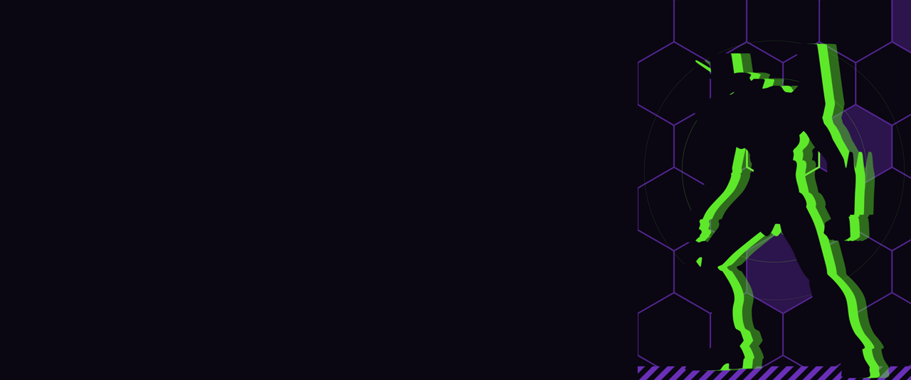</p>

**The figure.** Unit-01 stands to the right of your windows, on a hexagon field. It appears when the first
window on a workspace opens, then stays still. `Super+D` docks a window into its space, `Super+Shift+B` hides it.

<p align="center">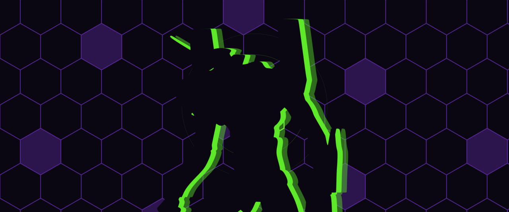</p>

**Maximise.** `Super+Return` fills the screen with the window, and a large Unit-01 fades in behind it.

<p align="center">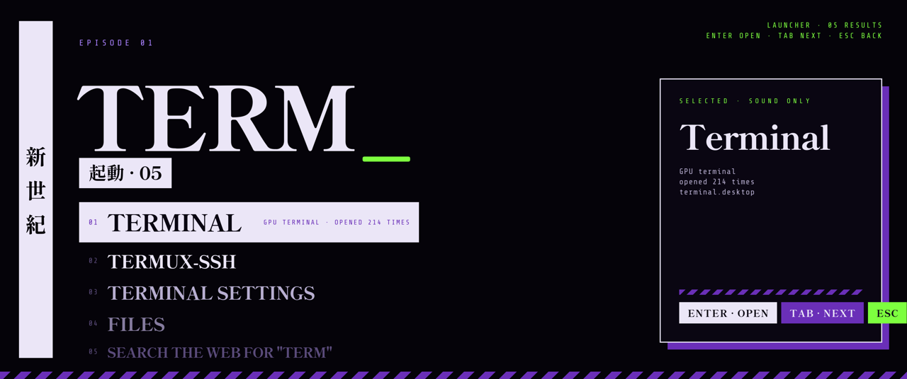</p>

**Launcher** (`Super+Space`). Type to search apps. The query is set large, matches are listed below it, the
selected one gets a detail card on the right.

<p align="center">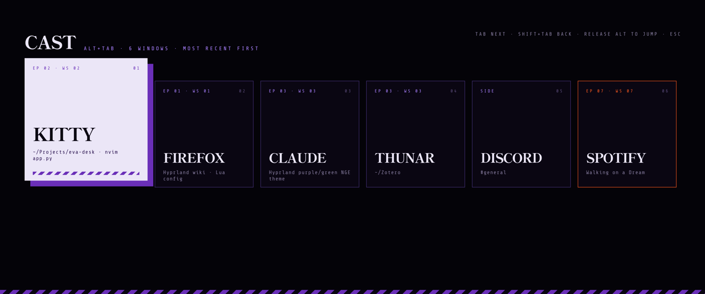</p>

**Alt+Tab.** Window switcher. One card per window, most recent first, with the workspace number. Release Alt to jump.

<p align="center">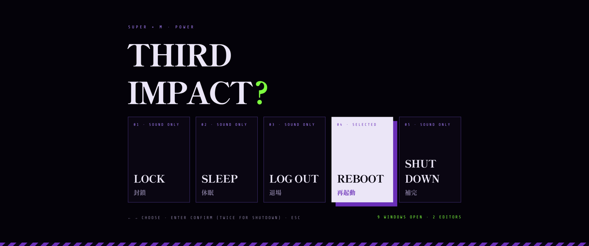</p>

**Power menu** (`Super+M`). Lock, sleep, log out, reboot, shut down. Shutting down and logging out ask twice.

<p align="center">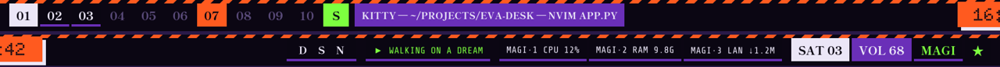</p>

**Bar.** Workspace tags, window title, clock, tray, now playing, CPU / RAM / network, date, volume. When a
workspace is urgent or the CPU is pegged it gets an orange warning strip (second row).

<p align="center">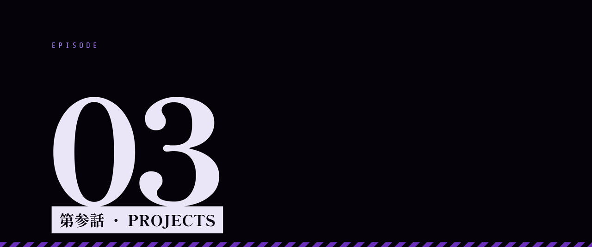</p>

**Workspace switch.** A card with the workspace number shows for a moment, then fades.

<p align="center">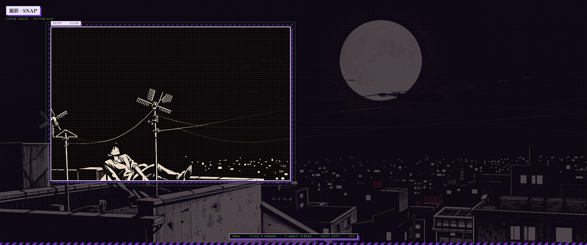</p>

**Screenshots** (`Print`). The screen freezes, you pick a region or a window, it goes to the clipboard and
to `~/Pictures/Screenshots`.

<p align="center">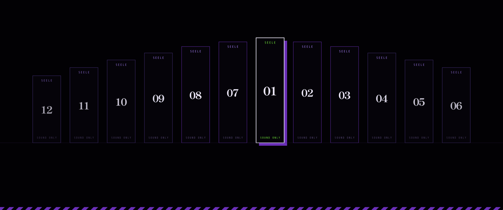</p>

**Lock screen** for hyprlock. One background per monitor, rendered at its size.

<p align="center">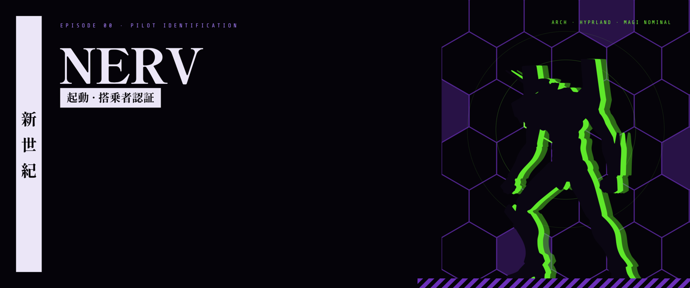</p>

**Login screen** for greetd with ReGreet.

And the rest, in short:

- **Wallpapers**: eleven scenes from the show (Unit-01 and the moon, Lilith, Ramiel over Tokyo-3, the cross,
  Sachiel, the Lance, the A.T. field, the train, the Geofront, the entry plug), one per workspace, shuffled.
- **Windows**: square corners, a slowly rotating lilac border, a hard purple shadow.
- **Small things**: a critical notification shows a warning band under the bar. A new window gets one hexagon pulse.
  The clock digits slide at the minute. After thirty seconds of a maxed-out CPU the stage turns orange until
  it cools down.

Your own keybinds are left alone. eva-desk adds `Super+Return`, `Super+Shift+B` and `Super+D`, and takes
over your launcher key, `Print`, `Alt+Tab` and `Super+M`. All of them can be changed or turned off.

## Install

```sh
git clone https://github.com/Singularitty/eva-desk
cd eva-desk
./install.sh --extras all --lock --gtk
```

This copies the program to `~/.local/share/eva-desk`, links `eva-desk`, `eva-ctl` and `eva-extras` into
`~/.local/bin`, downloads the fonts to `~/.local/share/fonts/eva-desk`, writes `~/.config/eva-desk/eva.toml`
and adds one line at the end of `~/.config/hypr/hyprland.lua` (a backup is kept):

```lua
dofile(os.getenv("HOME") .. "/.local/share/eva-desk/hypr/eva.lua")
```

Hyprland picks the change up on its own and the daemon starts. If you already run a bar or a wallpaper
script, turn them off, or disable eva-desk's with `[bar] enabled = false` and `[wallpapers] enabled = false`.

| flag | |
|---|---|
| `--extras all` | also theme kitty, starship, Neovim and the shell. A list works too: `--extras kitty,starship` |
| `--lock` | set up hyprlock: a background per monitor and a `hyprlock.conf` |
| `--gtk` | build the GTK 3 / 4 theme and icon theme. Thunar gets its own stylesheet. Needs an Everforest GTK theme installed to recolour |
| `--link` | run from the git checkout instead of a copy, handy for hacking on it |
| `--no-hypr` | do not touch `hyprland.lua` |
| `--no-fonts` | skip the font download |

### Dependencies

Hyprland 0.56 or newer with the Lua config, Python 3.11+, PyGObject, pycairo, GTK 4, gtk4-layer-shell.

Optional: `awww` or `swww` for wallpapers, `wpctl` for volume, `playerctl` for now playing, `grim` and
`wl-copy` for screenshots, `hyprlock` for the lock screen.

```sh
# Arch
sudo pacman -S --needed python-gobject python-cairo gtk4 gtk4-layer-shell awww grim wl-clipboard playerctl hyprlock
# Debian / Ubuntu
sudo apt install python3-gi python3-gi-cairo gir1.2-gtk-4.0 gir1.2-gtk4layershell-1.0
# Fedora
sudo dnf install python3-gobject python3-cairo gtk4 gtk4-layer-shell
```

### Monitors

Everything is sized from the monitor it is drawn on, so 16:9, 16:10, ultrawide, HiDPI and portrait screens
all work, and so do several monitors at once.

- `[general] main_monitors` lists the monitors that get the bar, the figure and the wallpapers, by output
  name or a part of the description. Leave it empty to use the largest one. Other monitors only get a static
  wallpaper.
- The space kept free for the figure defaults to `"auto"`: 30 % of the width on ultrawides, 24 % on 16:9
  and 16:10, 20 % on squarer screens. Put a number there to override it.
- The bundled wallpapers are 3440x1440 and get centre-cropped elsewhere. Your own images can be any size.
- Lock screen backgrounds are rendered per monitor. Run `tools/hyprlock_setup.py` again if you change your setup.

## Configuration

Everything lives in `~/.config/eva-desk/eva.toml`. [`config/eva.example.toml`](config/eva.example.toml) lists
every option with its default. After editing, run `eva-ctl apply`.

```sh
eva-ctl figure toggle          # the figure and its space (same as Super+Shift+B)
eva-ctl impact figure          # replay the entrance
eva-ctl herald                 # replay the maximise backdrop
eva-ctl eyecatch 3 PROJECTS    # try the workspace card
eva-ctl alarm "text"           # try the EMERGENCY band
eva-ctl alttab                 # the window switcher
eva-ctl power                  # the power menu
eva-ctl status | reload | quit
```

The sections you will probably touch:

| section | |
|---|---|
| `[figures]` | which workspaces get the figure, how much space it takes, the maximise backdrop, window classes to ignore (games) |
| `[wallpapers]` | the pool, a fixed wallpaper per workspace, named workspaces, other monitors |
| `[bar]` | height, number of tags, the readouts, now playing, tray, what clicks do, extra buttons |
| `[overlays]` | the workspace card, the EMERGENCY band, Alt+Tab, the power menu, the pulses, the berserk threshold |
| `[power]` | the commands behind lock / sleep / log out / reboot / shut down |
| `[hyprland]` | the keybinds, gaps, border style and speed |

### Colours and fonts

The palette and fonts are defined once, by role, in `eva_desk/themes.py`. Everything else reads from
there, including the GTK theme generator, the eww palette file and the app themes below. If you want a
different colour scheme, copy the `eva` entry, change the values, put your own figure and wallpapers in
`assets/themes/<name>/`, and switch with `eva-ctl theme <name>`. Files you list under `[theme] retheme_files`
are rewritten colour by colour on a switch.

The pictures were generated locally with stable-diffusion.cpp. The scripts are in `tools/gen/` if you want
to make your own figure: `sil.py` cuts a silhouette, `rig.py` builds the arm rig for the maximise figure,
`wallpaper.py` maps a picture onto the palette, `build_theme_assets.py` packs it all.

## Other apps

`eva-extras install kitty starship nvim shell`, or `all`, writes matching themes for:

| | what | needs |
|---|---|---|
| kitty | colours and a tab bar with numbered title blocks | `include ./eva.conf` and `tab_bar_style custom` in kitty.conf |
| starship | a prompt in the same style: git branch, command time, clock, and a warning block after a failed command | starship |
| nvim | colorscheme, status line, tab colours and dashboard | AstroNvim with heirline and snacks, or just the colorscheme |
| shell | zsh highlighting colours and a vivid theme for `ls` | source the file from `.zshrc` |

Every file it writes gets a backup next to it.

## Lock and login

**hyprlock.** `./install.sh --lock` (or `tools/hyprlock_setup.py`) renders a background for each monitor and
writes `~/.config/hypr/hyprlock.conf`. Your old file is backed up. The power menu's LOCK runs `hyprlock`;
pair it with hypridle if you want it on idle.

**ReGreet.** `tools/login_screen.py` renders the background and `greeter/regreet.css` styles the form.
`sudo greeter/install-greeter.sh` copies both into `/etc/greetd` and `/usr/share/backgrounds`, with backups.

## Resource use

Measured on the daemon at idle with a 3440x1440 main monitor:

| | |
|---|---|
| CPU, idle | about 0.4 % of one core (the bar's readouts refresh every 2 s; nothing else runs between events) |
| CPU, during an effect | a short spike while a texture renders, then back to idle. Animations run on the GPU through GTK |
| RAM | about 270 MB resident: GTK, the fonts, and the figure's backdrop kept ready at your monitor's size. Overlays and the launcher render when they open and are dropped when they close |
| GPU memory | about 100 MB at rest; a full-screen effect adds one texture while it is on screen |
| Disk | 9 MB for the program and pictures, plus 30 MB of fonts |

The daemon is a single Python process. It wakes up on Hyprland events (workspace, window, focus) and on
the readout timer, and draws nothing while the picture is still.

## FAQ

**Can I use it with `hyprland.conf`?** No. The border styles, workspace rules and binds are done through
Hyprland's Lua config.

**Something looks wrong on my screen.** `eva-desk --render /tmp/eva` writes PNGs of exactly what the daemon
draws. If those look right, the problem is in Hyprland; if not, open an issue with the PNG. The log is at
`~/.local/state/eva-desk/eva-desk.log`.

**The figure takes too much room.** `Super+Shift+B` hides it. `figure = 0` under `[figures]` removes it, and
`stage = 0.2` makes it narrower.

**Too much movement.** `[overlays]` has a switch for each motion. `eyecatch_style = "cut"` is a louder
version of the workspace card, `"soft"` the default, `eyecatch = false` turns it off. `berserk = 0` stops the
stage reacting to load.

**My game is on the figure's workspace.** Fullscreen games are ignored: the classes in
`[figures] ignore_classes` never get a figure, an eye-catch or a pulse.

**Uninstall.** `./uninstall.sh`. Add `--purge` to also delete the config and fonts.

## Development

```sh
python3 -m unittest discover -s tests     # logic tests, no compositor needed
eva-desk --render DIR                      # every scene, overlay, the bar and the launcher as PNGs
HL_VERIFY=1 Hyprland --verify-config -c ~/.config/hypr/hyprland.lua
```

Python, GTK 4 and gtk4-layer-shell. Drawing is cairo, animation is done with GTK snapshots on the GPU.

## Credits

Fonts from Google Fonts: Shippori Mincho B1, Share Tech Mono, Rubik, Doto (OFL). The GTK and icon
themes are recoloured copies of the Everforest GTK theme and the Everforest (Suru++) icon theme.
The figures and wallpapers were generated with stable-diffusion.cpp and Z-Image-Turbo.

Neon Genesis Evangelion belongs to Hideaki Anno, Gainax and Khara. This is a fan project.

MIT licence.
