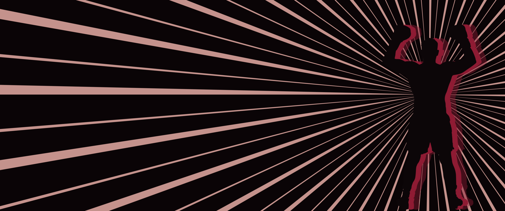

<p align="center">
  
</p>

<h1 align="center">eva-desk</h1>

<p align="center">
  An Evangelion-flavoured desktop layer for <b>Hyprland</b>: a figure that lives on your workspaces,
  a NERV bar, title-card launchers and menus, impact frames on everything you do.
</p>

<p align="center">
  <a href="#install">Install</a> ·
  <a href="#what-you-get">What you get</a> ·
  <a href="#themes">Themes</a> ·
  <a href="#configuration">Configuration</a> ·
  <a href="#extras-the-apps-around-the-desk">Extras</a> ·
  <a href="#lock-and-login-screens">Lock &amp; login</a> ·
  <a href="#faq">FAQ</a>
</p>

<p align="center">
  
  
  
  
</p>

---

## What you get

| | |
|---|---|
|  |  |
| **A figure on the stage.** Open the first window on a workspace and Unit-01 enters behind it: one smooth impact, then it stands still on an A.T. field of hexagons. Tiled windows keep to the left; `Super+D` docks a window into its space. | **The launcher** (`Super+Space`) as an episode title card: your query set like a title, the candidates as the cast list, the selection on a SOUND ONLY monolith. |
|  |  |
| **Alt+Tab** as a cast strip: one episode card per window, most recent first, release Alt to jump. | **Super+M** opens *Third Impact?*: lock, sleep, log out, reboot, shut down as monoliths. The cross of light plays when you confirm. |
|  |  |
| **Lock screen** (hyprlock): the SEELE council, SOUND ONLY, one picture per monitor. | **Login screen** (ReGreet): pilot identification, with Unit-01 on the field. |

And the rest of the desk:

- **The bar.** Workspace tags as title blocks, the window title, a clock badge, tray, now playing, MAGI readouts
  for CPU, RAM and network, date and volume. When something runs hot or a workspace is urgent the bar goes into
  **EMERGENCY**: an orange hazard strip and the clock flips orange.
- **The herald.** Maximise a window (`Super+Return`) and a giant Unit-01 rises behind it.
- **A screenshot tool** (`Print`) that freezes the screen, frames your pick in hazard stripes and stamps 撮影 · SNAP.
- **Wallpapers** per workspace: eleven Evangelion scenes (Unit-01 at the moon, Lilith, Ramiel over Tokyo-3, the
  cross, Sachiel, the Lance, the A.T. field, the train, the Geofront, the entry plug) with a halftone dot screen.
- **Windows** get square corners, a slow rotating lilac border and a hard purple drop shadow.
- **Motions, once each.** A workspace switch cuts to an episode card. A critical notification drops an
  EMERGENCY band under the bar. A new window pulses one hexagon. The clock's digits slide at the minute. Thirty
  seconds of a pegged CPU turn the stage berserk (orange) until it cools. Nothing loops.

<p align="center"></p>

Your keybinds stay. eva-desk adds `Super+Return`, `Super+Shift+B` (figure on/off), `Super+D` (dock a window)
and re-points your launcher key, `Print`, `Alt+Tab` and `Super+M`. Every bind is configurable.

## Install

```sh
git clone https://github.com/Singularitty/eva-desk && cd eva-desk
./install.sh --extras all --lock --gtk
```

The installer checks the dependencies, copies everything to `~/.local/share/eva-desk`, puts `eva-desk`,
`eva-ctl` and `eva-extras` in `~/.local/bin`, downloads the fonts (Google Fonts, OFL / Apache) to
`~/.local/share/fonts/eva-desk`, writes `~/.config/eva-desk/eva.toml`, and appends one line to the end of
`~/.config/hypr/hyprland.lua` (with a backup):

```lua
dofile(os.getenv("HOME") .. "/.local/share/eva-desk/hypr/eva.lua")
```

Hyprland reloads its config by itself and `eva.lua` starts the daemon. Then **turn off your old bar and
wallpaper script** (eva-desk brings both), or set `[bar] enabled = false` / `[wallpapers] enabled = false`.

| option | what it does |
|---|---|
| `--extras all` | the same look for kitty, starship, Neovim, Firefox, Discord, Spotify and the shell (or a list: `--extras kitty,starship`) |
| `--lock` | hyprlock: a SEELE council background rendered for each of your monitors plus `hyprlock.conf` |
| `--gtk` | a matching GTK 3 / GTK 4 theme (Thunar gets a NERV stylesheet and a Unit-01 watermark) and icon theme; built from an installed Everforest theme |
| `--theme vibe` | start with the other theme, the wine-and-gold fight card (see [Themes](#themes)) |
| `--link` | run from the checkout instead of a copy (edit, then `eva-ctl reload`) |
| `--no-hypr`, `--no-fonts` | leave `hyprland.lua` alone / skip the font download |

### Requirements

- **Hyprland 0.56+ with the Lua config** (`hyprland.lua`; the legacy `hyprland.conf` is not enough).
- Python 3.11+, PyGObject, pycairo, GTK 4, gtk4-layer-shell.
- Optional: `awww` or `swww` (wallpapers), `wpctl` (volume), `playerctl` (now playing), `grim` + `wl-copy`
  (screenshots), `hyprlock` (lock screen), `potrace` + `rsvg-convert` (only to build new figures).

```sh
# Arch
sudo pacman -S --needed python-gobject python-cairo gtk4 gtk4-layer-shell awww grim wl-clipboard playerctl hyprlock
# Debian / Ubuntu
sudo apt install python3-gi python3-gi-cairo gir1.2-gtk-4.0 gir1.2-gtk4layershell-1.0
# Fedora
sudo dnf install python3-gobject python3-cairo gtk4 gtk4-layer-shell
```

### Displays

Everything is drawn from the monitor's own size, so it works on 16:9, 16:10 and ultrawide screens, with
HiDPI scaling, portrait monitors, and more than one monitor.

- `[general] main_monitors` names the monitors that get the bar, the figure and the wallpapers (output name
  or a part of the description). Empty = the largest monitor. Other monitors get a static wallpaper.
- The stage (the space kept free for the figure) is `"auto"`: 30 % of the width on ultrawides, 24 % on
  16:9 / 16:10, 20 % on squarer screens. Set a number to pin it.
- Bundled wallpapers are 3440x1440 and are centre-cropped on other shapes; your own images go in `[wallpapers] pool`.
- Lock screen backgrounds are rendered per monitor at its size and orientation; re-run `tools/hyprlock_setup.py`
  after a monitor change.

## Themes

eva-desk ships two themes. Switch with `eva-ctl theme <name>`; it changes the palette, fonts, figures,
wallpapers, window borders, the GTK theme, the eww palette and every extra you installed, in one go.

| `eva` (default) · the NERV look | `vibe` · the fight card |
|---|---|
|  |  |
| Unit-01 purple, acid green, lilac on ink, NERV orange only when something is wrong. Shippori Mincho title cards, Share Tech Mono readouts, hexagons and hazard stripes. | Wine, bone and gold. Persona-5 skewed tags, speed lines, a boxer who slams onto the stage, a herald who praises the sun. |

A theme is a dictionary in `eva_desk/themes.py` (every colour by role, fonts, the launcher colourway,
Hyprland border styles, the GTK theme name) plus a folder `assets/themes/<name>/` (figures, the herald rig,
wallpapers). To make your own, copy an entry, change the colours, drop your pictures in the folder. The
Eva assets were generated locally with stable-diffusion.cpp; the pipeline is in `tools/gen/`.

## Configuration

`~/.config/eva-desk/eva.toml`. Every option with its default is in [`config/eva.example.toml`](config/eva.example.toml).
After editing, `eva-ctl apply` regenerates what Hyprland needs, reloads Hyprland and the daemon, rewrites
the eww palette if you use one, and runs your `after_apply` commands.

```sh
eva-ctl theme eva | vibe      # switch themes
eva-ctl boxer toggle          # the figure and its reserved space (also Super+Shift+B)
eva-ctl impact boxer          # play the entrance; eva-ctl herald plays the maximise rise
eva-ctl eyecatch 3 PROJECTS   # try the episode card; eva-ctl alarm "text" tries the EMERGENCY band
eva-ctl alttab | power        # the cast strip and the power menu, also on their keys
eva-ctl status | reload | quit
```

The sections you are most likely to touch:

| section | for |
|---|---|
| `[figures]` | which workspaces have the figure, the stage share, the herald, classes to ignore (games) |
| `[wallpapers]` | the pool, fixed wallpapers per workspace, named workspaces, other monitors |
| `[bar]` | height, tags, resource readouts, now playing, tray, click actions, extra buttons |
| `[overlays]` | eye-catch (`soft` or `cut`), EMERGENCY band, Alt+Tab, power menu, pulses, berserk |
| `[power]` | what lock / sleep / log out / reboot / shut down run |
| `[hyprland]` | the binds, gaps, rounding, border style and speed |
| `[theme]` | the active theme, the eww palette file, files to retheme or swap on a switch |

## Extras: the apps around the desk

`eva-extras install [--theme eva] kitty starship nvim firefox discord spotify shell` (or `all`):

| extra | what you get | needs |
|---|---|---|
| `kitty` | colours and a custom tab bar: numbered title blocks, a MAGI clock | `include ./vibe.conf` and `tab_bar_style custom` in kitty.conf |
| `starship` | the prompt as a NERV readout: `SYNC·branch`, `T+2s`, `MAGI·hh:mm`, a 緊急 EMERGENCY block after a failed command | starship |
| `nvim` | a colorscheme, a status line of title blocks, tab colours and a dashboard (AstroNvim / heirline / snacks) | Neovim with those plugins, or just `:colorscheme vibe` |
| `firefox` | userChrome and userContent: title-block tabs, a MAGI url bar, monolith menus, the field and Unit-01 on new tabs | restart Firefox |
| `discord` | a Vencord theme | [Vencord](https://vencord.dev) |
| `spotify` | a Spicetify theme: colours first, square corners, the hazard progress bar | [spicetify-cli](https://spicetify.app) |
| `shell` | zsh syntax-highlighting colours and a vivid LS_COLORS theme | source `~/.config/zsh/vibe.zsh` |

Files are written with backups next to them and registered in `[theme] retheme_files`, so a theme switch
keeps them in step. Extras are authored in the eva theme and rewritten role by role for any other.

## Lock and login screens

- **hyprlock**: `./install.sh --lock` or `tools/hyprlock_setup.py` renders the SEELE council for each monitor
  and writes `~/.config/hypr/hyprlock.conf` (title-card clock, MAGI readouts, the IDENTIFY · PILOT input, a
  backup of your old file). The power menu's LOCK runs it. Pair it with hypridle for auto-lock.
- **ReGreet** (greetd): `tools/login_screen.py` renders the background for your main monitor and
  `greeter/regreet-eva.css` styles the form. `sudo greeter/install-greeter.sh eva` installs both under
  `/etc/greetd` and `/usr/share/backgrounds` and backs up what it replaces.

## FAQ

**Does it work with `hyprland.conf`?** No. eva-desk hooks into Hyprland's Lua config (`hyprland.lua`) for the
border styles, workspace rules and binds.

**Something looks off on my monitor.** Run `eva-desk --render /tmp/eva` and look at the PNGs: that is
exactly what the daemon draws, at 3440x1440. Then `eva-desk --config ~/.config/eva-desk/eva.toml --render`
with your settings. The log is `~/.local/state/eva-desk/eva-desk.log`.

**The figure is in the way.** `Super+Shift+B` hides it and gives the space back; `boxer = 0` in `[figures]`
removes it for good. Games (`ignore_classes`) never see it.

**The motions are too much.** `[overlays]`: `eyecatch_style = "soft"` is the quiet card (default), `"cut"`
the loud one; every motion has its own switch, and `berserk = 0` stops the stage from reacting to load.

**Can I use my own wallpapers?** Yes: any image path in `[wallpapers] pool`, per workspace under
`[wallpapers.workspaces]`, and `[wallpapers.static]` for other monitors.

**Uninstall?** `./uninstall.sh` (keeps your config; `--purge` removes it and the fonts).

## Development

```sh
python3 -m unittest discover -s tests        # offline logic tests, no compositor needed
eva-desk --render DIR                         # every scene, overlay, the bar and the launcher as PNGs
HL_VERIFY=1 Hyprland --verify-config -c ~/.config/hypr/hyprland.lua
```

The daemon is Python with GTK 4 and gtk4-layer-shell; figures and overlays are drawn with cairo and animated
on the GPU through GTK snapshots. Nothing needs a running Hyprland to be rendered or tested.

## Credits

- Fonts from Google Fonts under the OFL / Apache licences: Shippori Mincho B1, Share Tech Mono, Anton,
  Archivo Black, Cinzel, Special Elite, Doto, VT323.
- The GTK and icon themes are recoloured from the Everforest GTK theme and the Everforest (Suru++) icon
  theme, which must be installed to build them.
- The figures and wallpapers were generated locally (stable-diffusion.cpp, Z-Image-Turbo) and are included
  under this repository's MIT licence.
- *Neon Genesis Evangelion* is the work of Hideaki Anno, Gainax and Khara. This is a fan-made look and is not
  affiliated with or endorsed by them.

<p align="center"><sub>SOUND ONLY</sub></p>
